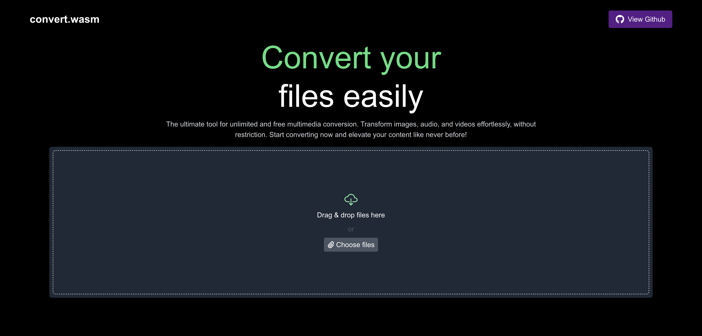
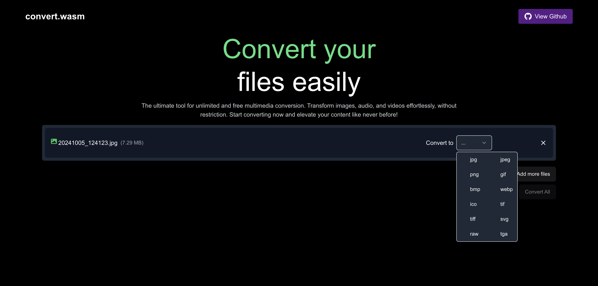

# convert.wasm

This is a lightweight, privacy-focused web application designed for converting image, video, and audio files to various formats. The application ensures data privacy as all conversions are processed directly in the browser using WebAssembly, without uploading files to any server.

## Features
- **Frontend Processing**: Files are converted directly in the browser using WebAssembly (Wasm), ensuring privacy.
- **Multi-Format Support**: Convert between various image, video, and audio formats.
- **Video to Audio Conversion**: Extract audio from video files.
- **Powered by FFmpeg**: Utilizes a WebAssembly build of the FFmpeg library for fast and efficient processing.

## How It Works
1. **Upload File**: Drag and drop or select a file from your device.
2. **Choose Format**: Select the desired output format (image, video, or audio).
3. **Convert**: The application processes the file in your browser using WebAssembly.
4. **Download**: Save the converted file directly to your device.

## Technologies Used
- **WebAssembly**: Enables high-performance file processing directly in the browser.
- **FFmpeg.wasm**: A WebAssembly build of the FFmpeg library for media conversions.
- **NextJS/TypeScript**: For creating a user-friendly frontend.

## Screenshots



## Getting Started
### Prerequisites
- A modern browser that supports WebAssembly.

### Development Setup
1. Clone the repository:
   ```bash
   git clone https://github.com/anoopaneesh/convert.wasm.git
2. Navigate to the project directory:
   ```bash
   cd convert.wasm
3. Install dependencies (if any):
   ```bash
   npm install
4. Run a local development server:
   ```bash
   npm start
5. Open the app in your browser at http://localhost:3000.

## Acknowledgments
- [FFmpeg](https://ffmpeg.org/) for providing the foundational media processing library.
- [FFmpeg.wasm](https://github.com/ffmpegwasm/ffmpeg.wasm) for enabling WebAssembly integration.

  
